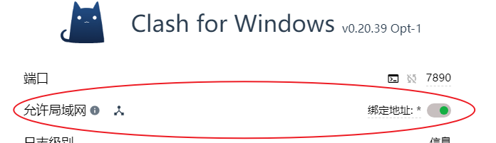
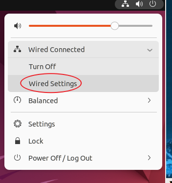
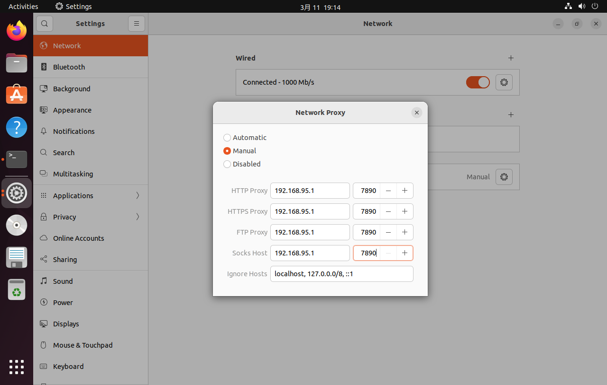
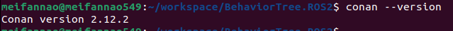
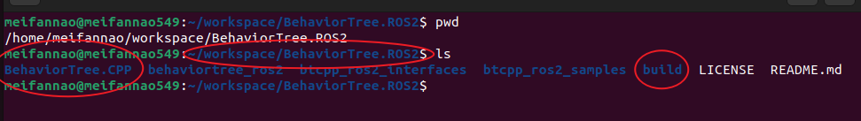
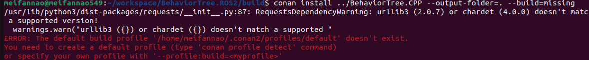
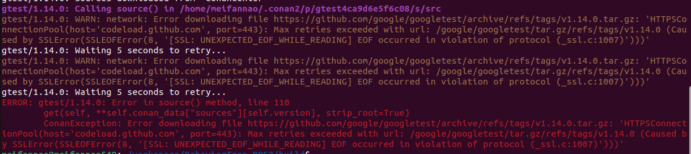
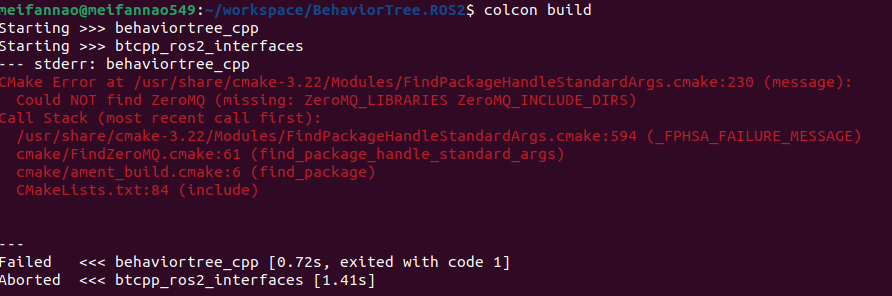
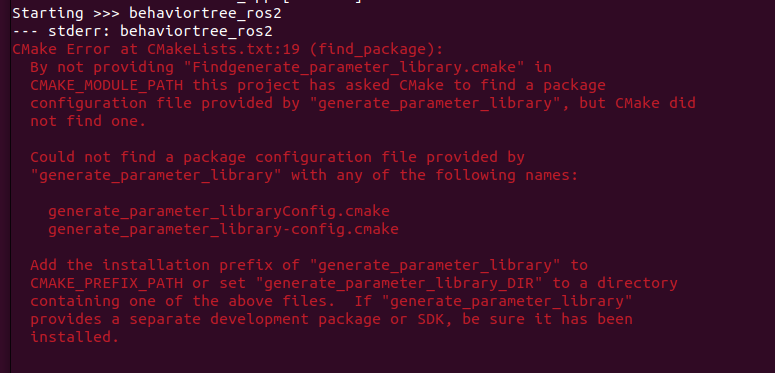
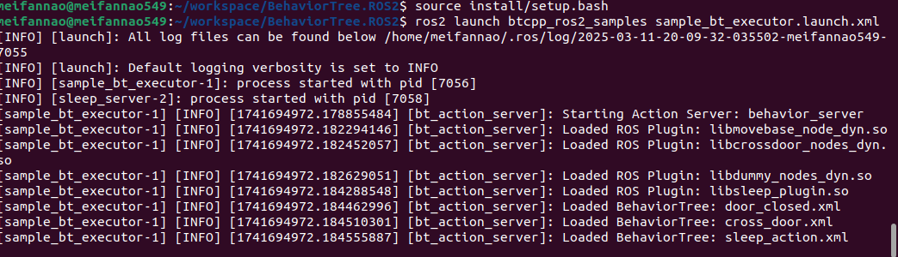

# BehaviorTree.ROS2 运行部署流程

## 前置准备

### Ubuntu 22.04 操作系统

要求满足
- 具备访问外网的能力，确保 git clone 可以正常运行
- 内存大于 12 GB

#### 虚拟机使用VPN教程

如果使用虚拟机可以参考如下步骤使用VPN，

1. 打开允许局域网



2. 打开Wired Settings



3. 宿主机(Windows 系统)执行 ipconfig 获得 VMnet8 的 IPV4 地址

4. 将 IPV4地址 + 端口号 填入，请注意 IPV4地址与端口号，填你自己的



### VsCode 安装

推荐使用鱼香ROS的一键安装
```
wget http://fishros.com/install -O fishros && . fishros
```

安装顺序为: `7`

### Git安装
```
sudo apt install git
```


### ROS2 环境准备

推荐使用鱼香ROS的一键安装
```
wget http://fishros.com/install -O fishros && . fishros
```

需要安装ROS2 Humble以及rosdepc

- 安装ROS2 Hubmle顺序执行顺序为：`1 1 2 1 1`
- 安装rosdepc 执行顺序为：`3`
- 执行 `rosdepc update`


## BehaviorTree.CPP 安装

### Conan 安装

BehaviorTree.CPP 推荐使用 Conan 管理依赖，如果需要其他方式，请参考 (BehaviorTree.CPP)[https://github.com/BehaviorTree/BehaviorTree.CPP]

使用 pip 安装即可，确保 Python 版本 >= 3.8，请使用系统Python3，而不是虚拟Python环境
```
pip install conan==2.12.2
```

安装完成后，请重新启动操作系统！！！确保系统能够找到conan
```
conan --version
```



### BehaviorTree.CPP 安装

`cd` 进入~目录，`mkdir workspace && cd workspace`

```
git clone https://github.com/BehaviorTree/BehaviorTree.ROS2.git

cd BehaviorTree.ROS2

git clone https://github.com/BehaviorTree/BehaviorTree.CPP.git

mkdir build
```

请检查路径位置



```
cd workspace/BehaviorTree.ROS2/build

conan install ../BehaviorTree.CPP --output-folder=. --build=missing
```

--- 
如果出现以下错误

#### 错误 1


请执行 `conan profile detect`，然后重新运行`conan install ../BehaviorTree.CPP --output-folder=. --build=missing` 确保在 build 目录下

#### 错误 2



说明虚拟机或者操作系统不能访问外网，conan 换源并没有很好的办法，建议使用VPN的方式

---

继续执行，其中 `cmake --build . --parallel` 需要内存足够，不然可能会导致虚拟机死机

```
cmake ../BehaviorTree.CPP -DCMAKE_TOOLCHAIN_FILE="conan_toolchain.cmake"
cmake --build . --parallel
```


## BehaviorTree.ROS2 安装

进入目录
```
cd ~/workspace/BehaviorTree.ROS2

colcon build
```

--- 
#### 错误 1



执行

```
sudo apt-get install libzmq3-dev
```
#### 错误 2



执行
```
sudo apt install ros-humble-generate-parameter-library
```

--- 

继续执行

```
source install/setup.bash
ros2 launch btcpp_ros2_samples sample_bt_executor.launch.xml
```

