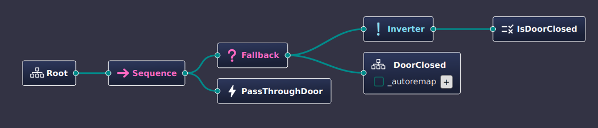
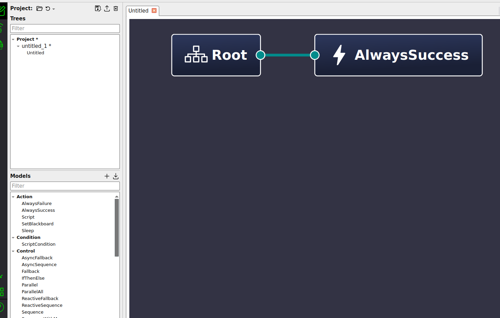
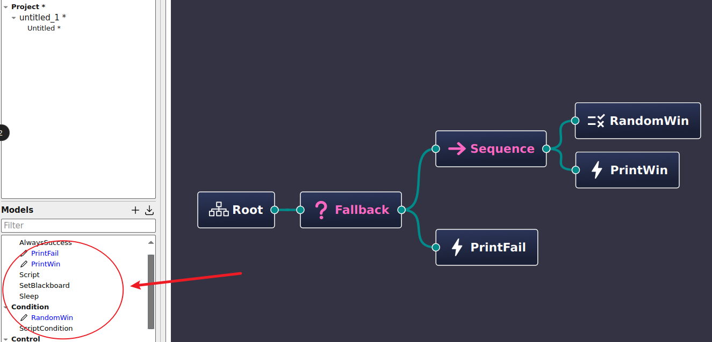
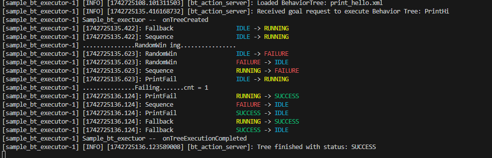
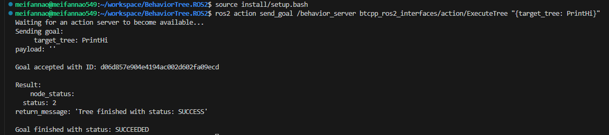

# BehaviorTree.CPP使用详解

## 前置准备

- [Groot2](https://www.behaviortree.dev/groot) 

## 基本概念

`btcpp_ros2_samples`目录下的`cross_door.xml`文件如下所示

```xml
<root BTCPP_format="4">
  <BehaviorTree ID="CrossDoor">
    <Sequence>
      <Fallback>
        <Inverter>
          <IsDoorClosed/>
        </Inverter>
        <SubTree ID="DoorClosed"/>
      </Fallback>
      <PassThroughDoor/>
    </Sequence>
  </BehaviorTree>
</root>

```

使用Groot2打开`cross_door.xml`



其中分为
- 控制节点
- 条件节点
- 动作节点

控制节点BehaviorTree.CPP内置，我们需要实现的是条件节点和动作节点.`cross_door.xml`的节点实现位置在`workspace/BehaviorTree.ROS2/BehaviorTree.CPP/sample_nodes`有`crossdoor_nodes.h`和`crossdoor_nodes.cpp`

头文件.h中`registerNodes`和`reset`必须实现，剩余节点为对应的动作节点和条件节点

对应的.cpp文件中，可以看到`registerNodes`是在通过注册回调函数的形式，将行为树节点进行注册

比如，下面注册了`IsDoorClosed`条件节点和`PassThroughDoor`动作节点并绑定了对应的回调函数，行为树在执行的时候，**通过注册的名称去找对应的函数**
```c++
factory.registerSimpleCondition("IsDoorClosed",
                                std::bind(&CrossDoor::isDoorClosed, this));

factory.registerSimpleAction("PassThroughDoor",
                            std::bind(&CrossDoor::passThroughDoor, this));
```

reset函数会在每次行为树被调用之前，恢复变量，确保行为逻辑正确.


## 如何编写自己的行为节点？

### Groot2创建行为树


首先，通过Groot2创建行为树，默认的行为树模板如下



首先，在Action和Condition中创建对应的节点，比如创建如下节点，并构造如下形式行为树



保存行为树为xml.如下所示
```xml
<?xml version="1.0" encoding="UTF-8"?>
<root BTCPP_format="4">
  <BehaviorTree ID="PrintHi">
    <Fallback>
      <Sequence>
        <RandomWin/>
        <PrintWin/>
      </Sequence>
      <PrintFail/>
    </Fallback>
  </BehaviorTree>

  <!-- Description of Node Models (used by Groot) -->
  <TreeNodesModel>
    <Action ID="PrintFail"
            editable="true"/>
    <Action ID="PrintWin"
            editable="true"/>
    <Condition ID="RandomWin"
               editable="true"/>
  </TreeNodesModel>

</root>
```

### 注册行为树节点

参照`crossdoor_nodes.h`和`crossdoor_nodes.cpp`，在对应目录下新建`printhi_node.h`和`printhi_node.cpp`.定义对应的条件节点和动作节点，并重载`registerNodes`和`reset`

关键点：
- 注册对应的条件节点和动作节点
- 实现对应的回调逻辑

```cpp
// printhi_node.h`
#pragma once

#include "behaviortree_cpp/bt_factory.h"

class PrintHi
{
public:
  void registerNodes(BT::BehaviorTreeFactory& factory);

  void reset();

  BT::NodeStatus RandomWin();

  BT::NodeStatus PrintFail();

  BT::NodeStatus PrintWin();

private:
  // cnt > 10 ? win : fail
  int _cnt = 0;
};

// printhi_node.cpp`
#include "printhi_node.h"

inline void SleepMS(int ms)
{
  std::this_thread::sleep_for(std::chrono::milliseconds(ms));
}

using BT::NodeStatus;

NodeStatus PrintHi::RandomWin()
{
  std::cout << "...............RandomWin ing................" << std::endl;
  SleepMS(200);
  _cnt ++;
  return _cnt > 10 ? NodeStatus::SUCCESS : NodeStatus::FAILURE;
}

NodeStatus PrintHi::PrintFail()
{
  SleepMS(500);
  if (_cnt <= 10) {
    std::cout << "...............Failing.......cnt = " << _cnt  << std::endl;
  }
  return _cnt <= 10 ? NodeStatus::SUCCESS : NodeStatus::FAILURE;
}

NodeStatus PrintHi::PrintWin()
{
  SleepMS(500);
  if (_cnt > 10) {
    std::cout << "...............Success.......cnt = " << _cnt  << std::endl;
  }
  return _cnt > 10 ? NodeStatus::SUCCESS : NodeStatus::FAILURE;
}


void PrintHi::registerNodes(BT::BehaviorTreeFactory& factory)
{
  factory.registerSimpleCondition("RandomWin",
                                  std::bind(&PrintHi::RandomWin, this));

  factory.registerSimpleAction("PrintFail",
                               std::bind(&PrintHi::PrintFail, this));

  factory.registerSimpleAction("PrintWin", std::bind(&PrintHi::PrintWin, this));
}

void PrintHi::reset()
{
  _cnt = 0;
}

// This function must be implemented in the .cpp file to create
// a plugin that can be loaded at run-time
BT_REGISTER_NODES(factory)
{
  static PrintHi print_hi;
  print_hi.registerNodes(factory);
}
```

### 修改CMakeList

观察crossdoor写了那些CMakeList，同理复制并修改一份即可，如果不会修改，请使用文本diff软件，对比修改前后CMakeList变化


```cmake
## 修改前
include_directories( ../include )

# compile as static libraries

set(CMAKE_DEBUG_POSTFIX "")

add_library(bt_sample_nodes STATIC
    crossdoor_nodes.cpp
    dummy_nodes.cpp
    movebase_node.cpp )

target_link_libraries(bt_sample_nodes PRIVATE ${BTCPP_LIBRARY})
set_target_properties(bt_sample_nodes PROPERTIES ARCHIVE_OUTPUT_DIRECTORY
    ${BTCPP_LIB_DESTINATION} )

# to create a plugin, compile them in this way instead

add_library(crossdoor_nodes_dyn SHARED crossdoor_nodes.cpp )
target_link_libraries(crossdoor_nodes_dyn PRIVATE ${BTCPP_LIBRARY})
target_compile_definitions(crossdoor_nodes_dyn PRIVATE  BT_PLUGIN_EXPORT )
set_target_properties(crossdoor_nodes_dyn PROPERTIES LIBRARY_OUTPUT_DIRECTORY
    ${BTCPP_BIN_DESTINATION} )

add_library(dummy_nodes_dyn     SHARED dummy_nodes.cpp )
target_link_libraries(dummy_nodes_dyn PRIVATE ${BTCPP_LIBRARY})
target_compile_definitions(dummy_nodes_dyn  PRIVATE BT_PLUGIN_EXPORT)
set_target_properties(dummy_nodes_dyn PROPERTIES LIBRARY_OUTPUT_DIRECTORY
    ${BTCPP_BIN_DESTINATION} )


add_library(movebase_node_dyn   SHARED movebase_node.cpp )
target_link_libraries(movebase_node_dyn PRIVATE ${BTCPP_LIBRARY})
target_compile_definitions(movebase_node_dyn PRIVATE  BT_PLUGIN_EXPORT )
set_target_properties(movebase_node_dyn PROPERTIES LIBRARY_OUTPUT_DIRECTORY
    ${BTCPP_BIN_DESTINATION} )

######################################################
# INSTALL plugins for other packages to load

INSTALL(TARGETS
    crossdoor_nodes_dyn
    dummy_nodes_dyn
    movebase_node_dyn
    LIBRARY DESTINATION share/${PROJECT_NAME}/bt_plugins
    ARCHIVE DESTINATION share/${PROJECT_NAME}/bt_plugins
    RUNTIME DESTINATION share/${PROJECT_NAME}/bt_plugins
)
```

```cmake
## 修改后
include_directories( ../include )

# compile as static libraries

set(CMAKE_DEBUG_POSTFIX "")

add_library(bt_sample_nodes STATIC
    crossdoor_nodes.cpp
    dummy_nodes.cpp
    movebase_node.cpp
    printhi_node.cpp )

target_link_libraries(bt_sample_nodes PRIVATE ${BTCPP_LIBRARY})
set_target_properties(bt_sample_nodes PROPERTIES ARCHIVE_OUTPUT_DIRECTORY
    ${BTCPP_LIB_DESTINATION} )

# to create a plugin, compile them in this way instead

add_library(crossdoor_nodes_dyn SHARED crossdoor_nodes.cpp )
target_link_libraries(crossdoor_nodes_dyn PRIVATE ${BTCPP_LIBRARY})
target_compile_definitions(crossdoor_nodes_dyn PRIVATE  BT_PLUGIN_EXPORT )
set_target_properties(crossdoor_nodes_dyn PROPERTIES LIBRARY_OUTPUT_DIRECTORY
    ${BTCPP_BIN_DESTINATION} )

add_library(dummy_nodes_dyn     SHARED dummy_nodes.cpp )
target_link_libraries(dummy_nodes_dyn PRIVATE ${BTCPP_LIBRARY})
target_compile_definitions(dummy_nodes_dyn  PRIVATE BT_PLUGIN_EXPORT)
set_target_properties(dummy_nodes_dyn PROPERTIES LIBRARY_OUTPUT_DIRECTORY
    ${BTCPP_BIN_DESTINATION} )


add_library(movebase_node_dyn   SHARED movebase_node.cpp )
target_link_libraries(movebase_node_dyn PRIVATE ${BTCPP_LIBRARY})
target_compile_definitions(movebase_node_dyn PRIVATE  BT_PLUGIN_EXPORT )
set_target_properties(movebase_node_dyn PROPERTIES LIBRARY_OUTPUT_DIRECTORY
    ${BTCPP_BIN_DESTINATION} )

add_library(printhi_node_dyn   SHARED printhi_node.cpp )
target_link_libraries(printhi_node_dyn PRIVATE ${BTCPP_LIBRARY})
target_compile_definitions(printhi_node_dyn PRIVATE  BT_PLUGIN_EXPORT )
set_target_properties(printhi_node_dyn PROPERTIES LIBRARY_OUTPUT_DIRECTORY
    ${BTCPP_BIN_DESTINATION} )

######################################################
# INSTALL plugins for other packages to load

INSTALL(TARGETS
    crossdoor_nodes_dyn
    dummy_nodes_dyn
    movebase_node_dyn
    printhi_node_dyn
    LIBRARY DESTINATION share/${PROJECT_NAME}/bt_plugins
    ARCHIVE DESTINATION share/${PROJECT_NAME}/bt_plugins
    RUNTIME DESTINATION share/${PROJECT_NAME}/bt_plugins
)
```

### 运行

重新编译
```
colcon build
source install/setup.bash 
ros2 launch btcpp_ros2_samples sample_bt_executor.launch.xml
```

新建终端
```
source install/setup.bash 
ros2 action send_goal /behavior_server btcpp_ros2_interfaces/action/ExecuteTree "{target_tree: PrintHi}"
```


